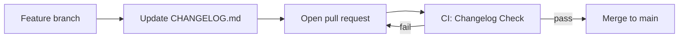

# [Startup-Name]

> [One-sentence description of your product]

**Status:** Early stage / Greenfield

## About

[Startup-Name] is a startup project built with AI-assisted development. Most implementation work is done by AI agents (Cursor Cloud Agents) following structured workflows defined in this repository.

Replace this section with your product vision, target audience, and value proposition once defined.

## Repository structure

```
startup/
├── .github/          # CI workflows, PR and issue templates
├── docs/             # Architecture docs and decision records (ADRs)
├── scripts/          # Automation scripts (e.g. changelog check)
├── src/              # Application source code
├── tests/            # Automated tests
├── AGENTS.md         # Rules for AI agents
├── CHANGELOG.md      # Project changelog (required on every PR)
└── CONTRIBUTING.md   # Contribution workflow
```

## Development workflow

This project follows a structured Git workflow designed for AI agents and human contributors alike:



1. Create a feature branch from `main`
2. Make changes (code, docs, config)
3. **Update `CHANGELOG.md`** under `[Unreleased]` — this is enforced by CI
4. Open a pull request
5. Wait for CI to pass, then merge

See [CONTRIBUTING.md](CONTRIBUTING.md) for details.

## AI agent development

If you are an AI agent working on this repository, read [AGENTS.md](AGENTS.md) before making any changes. Key rules:

- Always update `CHANGELOG.md` before opening a PR
- Keep changes minimal and focused
- Never commit secrets
- Follow existing code conventions in `src/`

## Local setup

The tech stack is not yet defined. Once chosen, document setup steps here and in [docs/architecture.md](docs/architecture.md).

```bash
# Clone the repository
git clone https://github.com/ursupp0rtmain/startup.git
cd startup

# Check changelog before pushing (optional)
chmod +x scripts/check-changelog.sh
./scripts/check-changelog.sh main
```

## Changelog

All changes are tracked in [CHANGELOG.md](CHANGELOG.md) following the [Keep a Changelog](https://keepachangelog.com/) format.

Every pull request must include a changelog entry. The GitHub Actions workflow **Changelog Check** enforces this automatically.

## Contributing

Read [CONTRIBUTING.md](CONTRIBUTING.md) for the full contribution guide, including:

- Branch naming conventions
- Changelog policy and exceptions
- Architecture Decision Records (ADRs)
- Branch protection setup for maintainers

## Branch protection (maintainers)

After the first push, enable branch protection on `main` in GitHub:

**Settings → Branches → Add rule:**

- Require pull request before merging
- Require status check: **Verify CHANGELOG.md was updated**

## License

License to be determined.

## Links

- [Changelog](CHANGELOG.md)
- [Contributing](CONTRIBUTING.md)
- [Agent instructions](AGENTS.md)
- [Architecture](docs/architecture.md)
