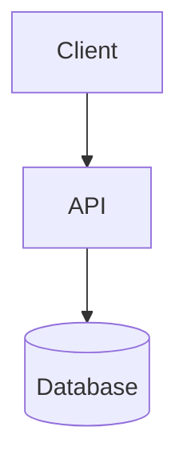

# Architecture

> **Status:** Greenfield — stack and components to be defined.

## Overview

<!-- One-paragraph description of what this system does -->

[Startup-Name] is a [one-sentence description of the product].

## Tech stack

| Layer | Technology | Notes |
|-------|-----------|-------|
| Frontend | _TBD_ | |
| Backend | _TBD_ | |
| Database | _TBD_ | |
| Infrastructure | _TBD_ | |

## Components

_Update this diagram once the actual architecture is defined._

## Directory layout

| Path | Purpose |
|------|---------|
| `src/` | Application source code |
| `tests/` | Automated tests |
| `docs/` | Documentation and ADRs |
| `scripts/` | Automation and utility scripts |

## Environment variables

Document required environment variables here once the stack is chosen. Use `.env.example` as the template file (never commit `.env`).

## Data flow

<!-- Describe how data moves through the system -->

_To be documented when features are implemented._

## Deployment

<!-- Describe how the app is built and deployed -->

_To be documented when infrastructure is set up._

## Related documents

- [Architecture Decision Records](decisions/) — significant technical decisions
- [AGENTS.md](../AGENTS.md) — rules for AI-assisted development
- [CONTRIBUTING.md](../CONTRIBUTING.md) — contribution workflow
