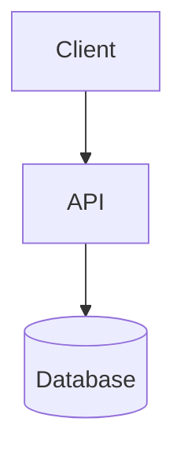

# Architecture

> **Status:** Greenfield — define your stack and components here.

## Overview

Verify App — A structured project built with igivafuk.

## Tech stack

| Layer | Technology | Notes |
|-------|-----------|-------|
| Frontend | _TBD_ | |
| Backend | _TBD_ | |
| Database | _TBD_ | |
| Infrastructure | _TBD_ | |

## Components

_Update this diagram once the actual architecture is defined._

## Directory layout

| Path | Purpose |
|------|---------|
| `src/` | Application source code |
| `tests/` | Automated tests |
| `docs/` | Documentation and ADRs |
| `scripts/` | Automation and utility scripts |

## Environment variables

Use `.env.example` as the template. Never commit `.env`.

## Related documents

- [Architecture Decision Records](decisions/)
- [AGENTS.md](../AGENTS.md)
- [CONTRIBUTING.md](../CONTRIBUTING.md)
- [igivafuk](https://idontgivaf.uk)
